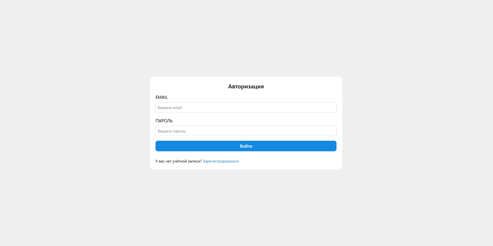
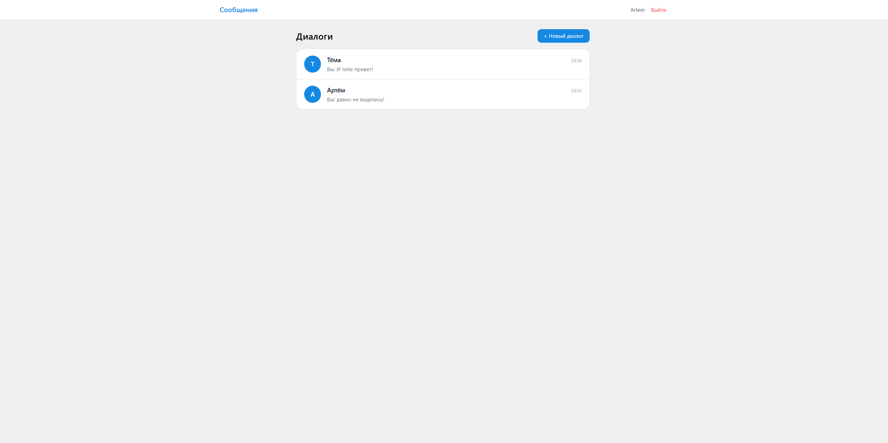
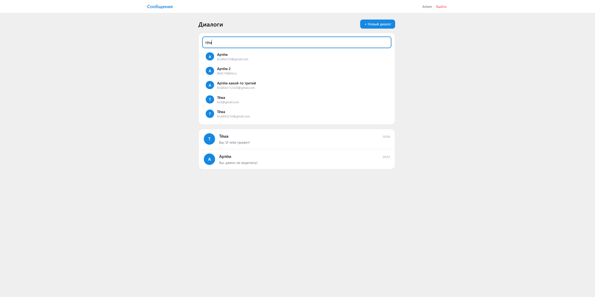
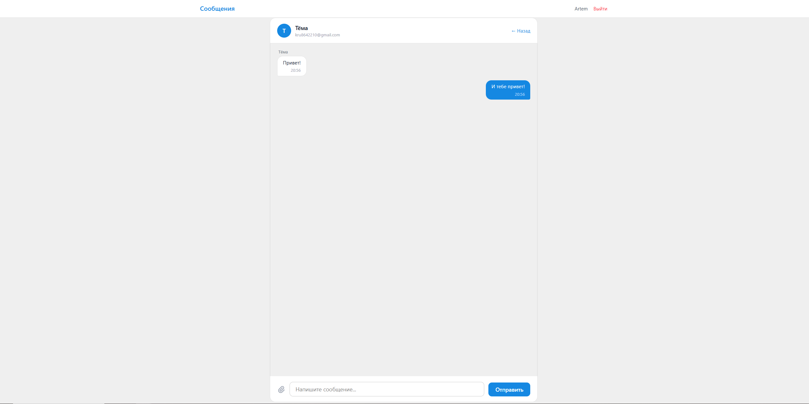

# Laravel Messenger

Учебный Laravel-проект: простое веб-приложение для личных диалогов между пользователями.

Проект был сделан для практики backend-разработки на Laravel: маршрутизация, контроллеры, модели, связи между таблицами, авторизация, работа с формами, AJAX-запросы и загрузка файлов.

## Скриншоты

### Страница входа



### Список диалогов



### Поиск пользователей



### Диалог с сообщениями




## Стек

* PHP
* Laravel
* MySQL
* Eloquent ORM
* Blade
* JavaScript
* AJAX
* Tailwind CSS
* Composer
* npm / Vite

## Возможности

* регистрация пользователя;
* вход и выход из аккаунта;
* защита маршрутов для авторизованных и неавторизованных пользователей;
* список личных диалогов;
* создание или открытие существующего диалога с другим пользователем;
* поиск пользователей;
* отправка сообщений без перезагрузки страницы;
* получение новых сообщений через AJAX polling;
* загрузка файлов в сообщениях;
* отметка сообщений как прочитанных;
* работа со связями между пользователями, диалогами и сообщениями.

## Что было реализовано на backend

* собственная аутентификация через контроллер;
* валидация данных при регистрации, входе и отправке сообщений;
* хэширование пароля;
* защита от session fixation через обновление сессии после входа;
* проверка доступа пользователя к конкретному диалогу;
* JSON-ответы для AJAX-запросов;
* сохранение загруженных файлов в storage;
* работа с отношениями Eloquent: пользователь, диалог, сообщение.

## Структура проекта

## Структура проекта

```text
app/Http/Controllers/
  AuthController.php            # регистрация, вход, выход пользователя
  ConversationController.php    # список диалогов, открытие/создание диалога, поиск пользователей
  MessageController.php         # отправка сообщений, загрузка файлов, получение новых сообщений

app/Models/
  User.php                      # пользователь
  Conversation.php              # диалог между пользователями
  Message.php                   # сообщение

database/migrations/
  ...create_users_table.php
  ...create_conversations_table.php
  ...create_messages_table.php
  ...create_conversations_user_table.php

resources/views/
  auth/                         # страницы регистрации и входа
  Conversations/                # страницы списка диалогов и чата
  layouts/                      # общий layout

routes/
  web.php                       # маршруты авторизации, диалогов и AJAX-запросов
```

## Установка и запуск

```bash
git clone https://github.com/Gouzeman/chat.git
cd chat
```

Установить зависимости PHP:

```bash
composer install
```

Установить frontend-зависимости:

```bash
npm install
```

Создать `.env`:

```bash
cp .env.example .env
```

Сгенерировать ключ приложения:

```bash
php artisan key:generate
```

Настроить подключение к базе данных в `.env`:

```env
DB_DATABASE=your_database
DB_USERNAME=your_username
DB_PASSWORD=your_password
```

Выполнить миграции:

```bash
php artisan migrate
```

Создать символическую ссылку для файлов:

```bash
php artisan storage:link
```

Запустить backend, например:

```bash
php artisan serve
```

Запустить сборку frontend:

```bash
npm run dev
```

## Статус проекта

Учебный проект. Основная цель — закрепить базовые возможности Laravel и backend-разработки: авторизация, маршруты, контроллеры, работа с БД, связи между сущностями и AJAX-взаимодействие.

## Что можно улучшить

* добавить тесты;
* добавить Laravel Form Request для валидации;
* вынести часть логики из контроллеров в сервисы;
* добавить WebSocket-вариант обновления сообщений вместо polling;
* улучшить UI и адаптивность;
* добавить роли пользователей или настройки профиля.
